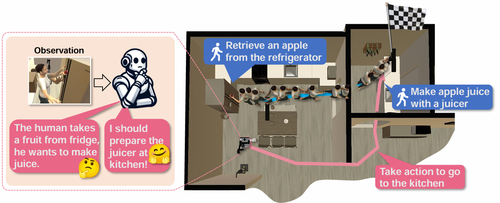

# CoNav: A Benchmark for Human-Centered Collaborative Navigation

  

<!--      -->
     
<!--      -->
  

## 🔥 Two-stages Activities Demos
a person exercises on the treadmill -> a person takes a shower in the shower             |  a person takes a broom from the stand -> a person cleans the carpet
:-------------------------:|:-------------------------:
  |  

## 🔎 Abstract

    

 
Human-robot collaboration, in which the robot intelligently assists the human with the upcoming task, is an appealing objective. To achieve this goal, the agent needs to be equipped with a fundamental collaborative navigation ability, where the agent should reason human intention by observing human activities and then navigate to the human’s intended destination in advance of the human. However, this vital ability has not been well studied in previous literature. To fill this gap, we propose a collaborative navigation (CoNav) benchmark. Our CoNav tackles the critical challenge of constructing a 3D navigation environment with realistic and diverse human activities. To achieve this, we design a novel LLM-based humanoid animation generation framework, which is conditioned on both text descriptions and environmental context. The generated humanoid trajectory obeys the environmental context and can be easily integrated into popular simulators. We empirically find that the existing navigation methods struggle in CoNav task since they neglect the perception of human intention. To solve this problem, we propose an intention-aware agent for reasoning both long-term and short-term human intention. The agent predicts navigation action based on the predicted intention and panoramic observation. The emergent agent behavior including observing humans, avoiding human collision, and navigation reveals the efficiency of the proposed datasets and agents.

## 📝 TODO List
- [ ] Release CoNav dataset.
- [ ] Release code for collaborative navigation.
- [ ] Release pre-trained models.
